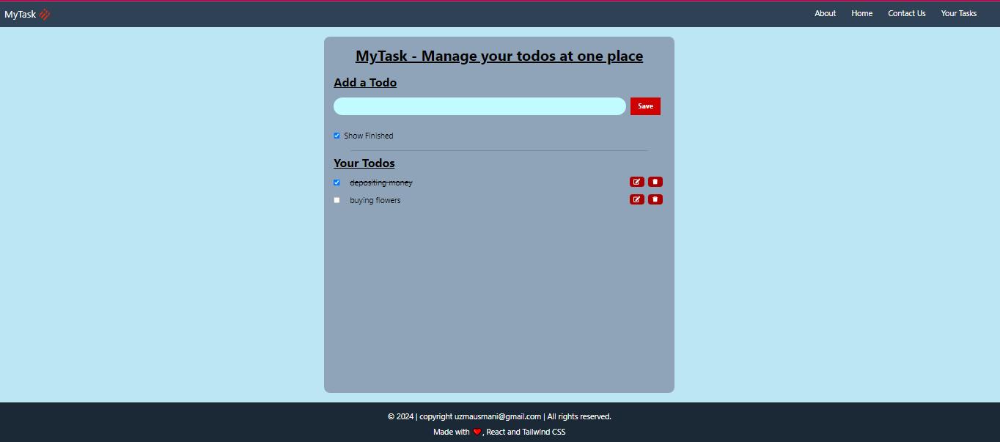

# React + Vite

# React Todo App

This is a simple Todo application built with React.js and Tailwind CSS. It allows users to add, edit, and delete tasks, as well as mark them as completed.

## Features

- Add a new Todo
- Edit existing Todo
- Delete Todo
- Mark Todo as completed
- Toggle visibility of completed Todos

## Technologies Used

- React.js
- Tailwind CSS
- React Icons
- uuid

